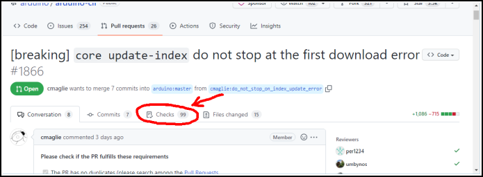
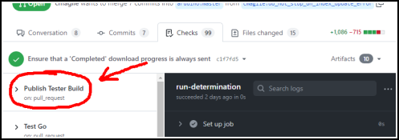
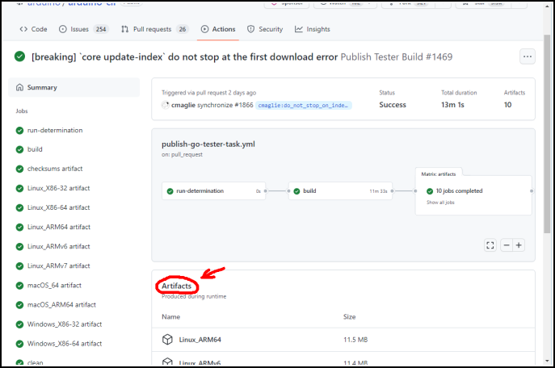

<!-- Source: https://github.com/arduino/tooling-project-assets/blob/main/documentation-templates/contributor-guide/application/contributor-guide/beta-testing.md -->

# Beta Testing Guide

Beta testing of development versions is a valuable contribution to the project. You can help to ensure the quality of the production release that will be distributed to the user community.

Builds of the project are automatically created after every relevant change to the project in order to make it easy for anyone to participate in the testing effort.

---

❗ Make sure to always download the newest available tester build in order to ensure effective results from your beta testing efforts.

---

Beta testing is done during both the proposal (pull request) and pre-release (nightly build) phases of development:

## Testing Pull Requests

Tester builds are automatically created for every [pull request](https://docs.github.com/pull-requests/collaborating-with-pull-requests/proposing-changes-to-your-work-with-pull-requests/about-pull-requests) (PR) that proposes a relevant change.

The builds are updated if the author pushes changes to the PR.

### Installation

The tester build for a PR can be downloaded by following these instructions:

1. Sign in to your [**GitHub**](https://github.com/) account. 
   (GitHub only allows downloads of the tester builds when you are signed in.)
1. Open the PR you are interested in. 
   They are listed here: 
   https://github.com/arduino/TODO_REPO_NAME/pulls
1. Click the "**Checks**" tab at the top of the PR's page.
1. From the list on the left side of the page, click on "**Publish Tester Build**".
1. From the "**Artifacts**" section of the page that opens, click the download link for your operating system. 
   **ⓘ** For example, if you are using Windows, click the "**Windows_X86-64_zip**" link.
1. Wait for the download to finish.
1. Extract or install the downloaded file as usual.

### Feedback

Feedback after beta testing a pull request is always valuable, regardless of which categories your findings fall under:

- working as expected
- problems encountered
- areas for improvement

Please submit feedback related to the changes made in the pull request as a PR review:

https://docs.github.com/pull-requests/collaborating-with-pull-requests/reviewing-changes-in-pull-requests/about-pull-request-reviews

---

If you discover problems or areas for improvement that are unrelated to the changes made by the PR (i.e., they also occur when using the [nightly build](#testing-nightly-build)), please submit that feedback as an issue report instead of a review.

[More information on issue reports](issues.md#issue-report-guide)

## Testing Nightly Build

Builds of the project's production branch are produced daily. This build represents the current pre-release state of the project, which is planned for distribution in the next release.

### Installation

<!-- TODO: Add instructions for installation of project's nightly build -->

### Feedback

If you discover any problems or areas for improvement please submit an issue report.

[More information on issue reports](issues.md#issue-report-guide)
